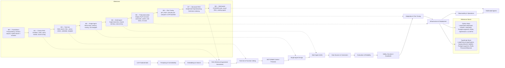

## Agents and LLMs Roadmap (Mermaid)

Generated from `universe.md`.

```mermaid
flowchart LR
  %% High-level roadmap from foundations to advanced
  A["LLM Fundamentals"] --> B["Prompting & Controllability"]
  B --> C["Embeddings & Search"]
  C --> D["RAG (Retrieval Augmented Generation)"]
  D --> E["Tool Use & Function Calling"]
  E --> F["MCP (Model Context Protocol)"]
  F --> G["Single‑Agent Design"]
  G --> H["Multi‑Agent (A2A)"]
  H --> I["Data Sources & Connectors"]
  I --> J["Evaluation & Reliability"]
  J --> K["Safety, Security & Guardrails"]
  K --> L["Adaptation & Fine‑Tuning"]
  L --> M["Infrastructure & Deployment"]
  M --> N["Observability & Operations"]
  N --> O["Multimodal Agents"]

  %% Milestones
  subgraph Milestones
    direction LR
    m0["M0 — Foundations\nPrompt library, schema outputs, hybrid search + reranker"]
    m1["M1 — Classic RAG\nCitations, evals, query rewrite, chunk tuning"]
    m2["M2 — Tool Use\nWeb search, SQL, vector; retries, validation, budgets"]
    m3["M3 — Single Agent\nReAct loop, memory, tracing, cost budgets"]
    m4["M4 — Multi‑Agent\nSupervisor/critic, shared memory, concurrency"]
    m5["M5 — Productionization\nDeploy Py/TS services, autoscale, caches, rate limits, CI evals"]
    m6["M6 — Fine‑Tuning\nSFT, PEFT, DPO/RLAIF; compare vs API baseline"]
    m7["M7 — Advanced RAG\nGraph/multi‑hop/streaming; freshness indexing"]
    m8["M8 — Multimodal\nOCR/ASR tools, visual RAG, meeting agent"]
    m0 --> m1 --> m2 --> m3 --> m4 --> m5 --> m6 --> m7 --> m8
  end

  %% Reference stacks
  subgraph Reference Stacks
    direction LR
    py["Python Stack\nLangChain/LangGraph, FastAPI, Celery/RQ, Postgres+pgvector, Redis, OpenSearch, vLLM/TGI"]
    ts["TypeScript Stack\nLangChain.js/LangGraph.js, Express/NestJS, BullMQ, Postgres+pgvector, Redis, Pinecone/Weaviate"]
  end

  M --> py
  M --> ts

  %% Cross‑links from milestones to phases (indicative)
  m1 -.-> D
  m2 -.-> E
  m3 -.-> G
  m4 -.-> H
  m5 -.-> M
  m6 -.-> L
  m7 -.-> D
  m8 -.-> O
```
